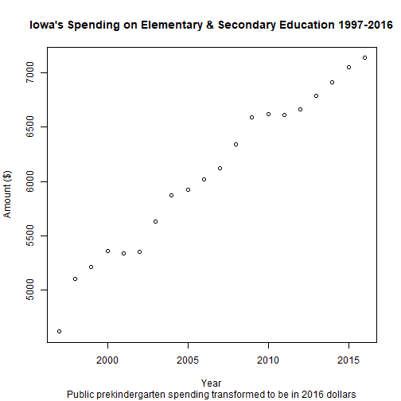
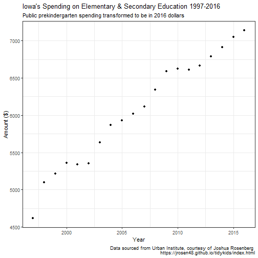

The Power of the Pipe (%>%)
========================================================
author: Jarren Santos
date: Last updated October 3, 2020
autosize: true


Outline
========================================================
1. Background
2. Pipes (`%>%`)  
  a. `%>%` as a concept  
  b. Applying `%>%` to data   
3. With great `%>%` comes great `%>%`  
  a. Pros and cons


Assumptions
========================================================
I assume you swim in the following pools of knowledge prior to digesting this information.

1. You have a basic understanding of the R programming language.  
  a. Scripts, object assignment, classes
2. You have a basic understanding of data manipulation and exploratory data analysis.  
  a. Cleaning, plotting, identifying patterns
3. You are interested in exploring more about R and how it is used collaboratively.  
  a. {tidyverse}, {dplyr}, {ggplot2}


Background
========================================================
What is a pipe (`%>%`)?

* Powerful R operator from `{magrittr}`
* Allows for an object to move into another sequence
* Popular dependency for other R packages (`{tidyverse}`)

```
Result <- Object %>% 
  Function1(Object) %>% 
  Function2(Function1(Object)) %>% 
  Function3(Function2(Function1(Object)))
```


Background (cont.)
========================================================
As stated by Stefan Milton Bache (created `{magrittr}`), the `%>%` aims to:

1. Decrease development time
2. Improve readability and maintainability of code

In my opinion, incorporating the `%>%` into your code also allows you to:

1. Perform multiple steps with one call
2. Organize your code to improve data analysis workflow
3. Strike balance between readability & efficiency


  
Pipe Conceptual Model
========================================================
```
jarren
```


Pipe Conceptual Model
========================================================
```
jarren %>%
  add_coffee()
```

 `%>%` 


Pipe Conceptual Model
========================================================
```
jarren %>%
  add_coffee() %>%
  wear_headphones()
```

 `%>%`  `%>%`  


Pipe Conceptual Model
========================================================
```
jarren %>%
  add_coffee() %>%
  wear_headphones() %>%
  get_to_work()
```

 `%>%` 
   `%>%` 
   `%>%` 
  


Prior to the Pipe
========================================================

Dataset: [U.S. Government Spending on Kids](https://github.com/rfordatascience/tidytuesday/blob/master/data/2020/2020-09-15/readme.md)

> This dataset provides a comprehensive accounting of public spending on children from 1997 through 2016. It draws on the US Census Bureau’s Annual Survey of State and Local Government Finances, as well as several federal and other noncensus sources, to capture state-by-state spending on education, income security, health, and other areas. 

Source: [Urban Institute](https://datacatalog.urban.org/dataset/state-state-spending-kids-dataset) via [Joshua Rosenberg](https://twitter.com/jrosenberg6432)'s [`{tidykids}`](https://jrosen48.github.io/tidykids/index.html)


Prior to the Pipe (cont.)
========================================================

NOTE full variable codebook at: [`{tidykids}` pkgdown site](https://jrosen48.github.io/tidykids/articles/tidykids-codebook.html).

|variable         |class     |description |
|:----------------|:---------|:-----------|
|state            |character | United States state (and the District of Columbia) |
|variable         |character | Type of spending|
|year             |double    | Year |
|raw              |double    |  The value of the variable; a numeric value|
|inf_adj          |double    | The value of the variable, adjusted for inflation, a numeric value |
|inf_adj_perchild |double    | The value of the variable adjusted for inflation, per child; a numeric value|


Prior to the Pipe (cont.)
========================================================
Goals to accomplish for data analysis exercise:

1. Import data.
2. Filter data to only show Iowa's spending on elementary & secondary education over time.
3. Summarize data into a clean data visualization.
4. Prepare code for distribution to people of different backgrounds, expertise, etc.


Prior to the Pipe (cont.)
========================================================
`{base}` Implementation, Intermediate Steps


```r
kids_a <- subset(kids, state == "Iowa")
kids_b <- kids_a[kids_a$variable == "PK12ed", ]
kids_b$inf_adj_perchild_actual <- kids_b$inf_adj_perchild * 1000
kids_c <- kids_b[, c("year", "inf_adj_perchild_actual")]
plot(kids_c$year, kids_c$inf_adj_perchild_actual,
     main = "Iowa's Spending on Elementary & Secondary Education 1997-2016",
     sub = "Public prekindergarten spending transformed to be in 2016 dollars",
     xlab = "Year",
     ylab = "Amount ($)")
```

Prior to the Pipe (cont.)
========================================================



Prior to the Pipe (cont.)
========================================================
`{tidyverse}` Implementation, Overriding Objects


```r
kids <- filter(.data = kids, state == "Iowa", variable == "PK12ed")
kids <- mutate(.data = kids, inf_adj_perchild_actual = inf_adj_perchild * 1000)
kids <- select(.data = kids, year, inf_adj_perchild_actual)
```


Prior to the Pipe (cont.)
========================================================
`{tidyverse}` Implementation, Overriding Objects


```r
ggplot(data = kids, aes(x = year, y = inf_adj_perchild_actual)) +
  theme_bw() +
  geom_point() +
  labs(title = "Iowa's Spending on Elementary & Secondary Education 1997-2016",
       subtitle = "Public prekindergarten spending transformed to be in 2016 dollars",
       caption = "Data sourced from Urban Institute, courtesy of Joshua Rosenberg \n https://jrosen48.github.io/tidykids/index.html") +
  xlab("Year") + 
  ylab("Amount ($)")
```


Prior to the Pipe (cont.)
========================================================



Present to the Pipe
========================================================
`{tidyverse}` Implementation, `%>%` Power


```r
kids %>%
  filter(state == "Iowa", variable == "PK12ed") %>%
  mutate(inf_adj_perchild_actual = inf_adj_perchild * 1000) %>%
  select(year, inf_adj_perchild_actual) %>%
  ggplot(aes(x = year, y = inf_adj_perchild_actual)) +
  theme_bw() +
  geom_point() +
  labs(title = "Iowa's Spending on Elementary & Secondary Education 1997-2016",
       subtitle = "Public prekindergarten spending transformed to be in 2016 dollars",
       caption = "Data sourced from Urban Institute, courtesy of Joshua Rosenberg \n https://jrosen48.github.io/tidykids/index.html") +
  xlab("Year") + 
  ylab("Amount ($)")
```


Present to the Pipe (cont.)
========================================================


With great (pipe) power comes great (pipe) responsibility
========================================================
You are not always going to want to use the pipe.

1. Maybe you shouldn't do your entire grocery shopping trip all at once.  
  a. If I buy all my ingredients at once, then I am going to have to figure out how to use all my items and minimize food waste.  
  b. If I split my grocery shopping into x number of trips, then it may allow me to accomplish something else (i.e., having fresh stock of produce).
2. Prior to saving Princess Peach, Super Mario doesn't have to defeat all the enemies, collect all the coins and stars, and complete the stage all at once.  
  a. Speed run  
  b. Collecting resources (i.e., stocking up on green mushrooms/lives to prepare for boss battles)  

Consider when it is best to use the pipe (along with its pipe alternatives!).


Why should I use the Pipe again?
========================================================

1. Accomplish multiple steps in just one call of code.
2. Enhance readability of code.
3. Improve efficiency in developing and understanding code.


References
========================================================
**{magrittr} Pipe (%>%)**

Garrett Grolemund and Hadley Wickham. 2020. Chapter 18: Pipes. *R for Data Science*. https://r4ds.had.co.nz/pipes.html.

Bradley Boehmke. 2016. Simplify Your Code with %>%. University of Cincinnati Business Analytics R Programming Guide. https://uc-r.github.io/pipe.

Stefan Milton Bache and Hadley Wickham. 2014. magrittr: A Forward-Pipe Operator for R. R package version 1.5. https://CRAN.R-project.org/package=magrittr.

{magrittr} %>% Documentation. https://magrittr.tidyverse.org/reference/pipe.html.


References (cont.)
========================================================
**Pipe (%>%) Alternatives**

Kun Ren. 2016. pipeR: Multi-Paradigm Pipeline Implementation. R package version 0.6.1.3. https://CRAN.R-project.org/package=pipeR.

Kun Ren. pipeR Tutorial. https://renkun-ken.github.io/pipeR-tutorial/index.html

Antoine Fabri. 2020. nakedpipe: Pipe Into a Sequence of Calls Without Repeating the Pipe Symbol. https://github.com/moodymudskipper/nakedpipe


References (cont.)
========================================================
**Critiques of the Pipe (%>%)**

Kun Ren. 2014. Differences between magrittr and pipeR. https://renkun.me/2014/08/08/difference-between-magrittr-and-piper/

John Mount and Nina Zumel. 2018. *Dot-Pipe: an S3 Extensible Pipe for R*. The R Journal, 2018(10:2). https://cran.r-project.org/web/packages/wrapr/vignettes/wrapr_pipe.pdf


